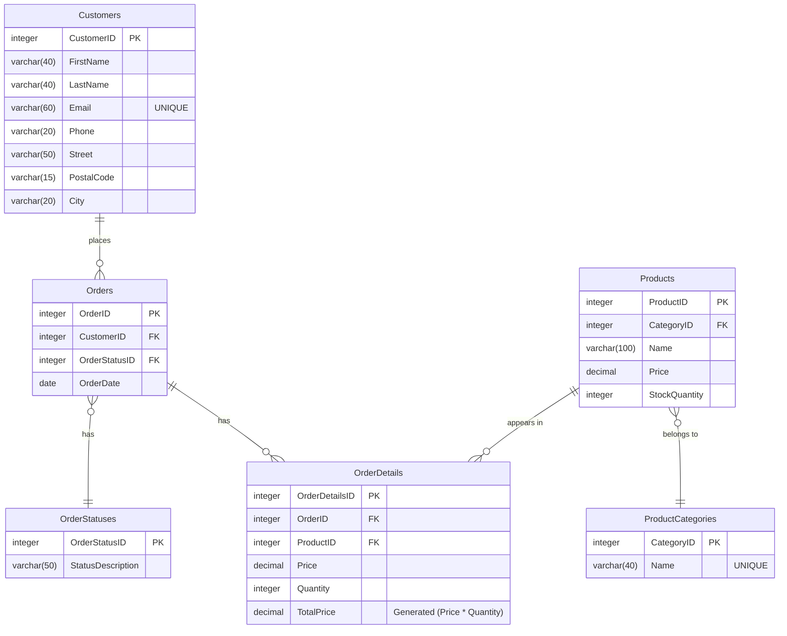

>**Betygsmål:** Jag strävar efter ett **VG** och har gjort mitt yttersta i att försöka implementera funktionalitet och lösningar i databasen som uppfyller kraven som ställts. Allt är även förklarat så utförligt och detaljerat som möjligt.

# E-handels-databas

## STEG 0: Skapar databasen

```SQL
CREATE DATABASE ECommerceDB;  -- Skapar databasen

USE ECommerceDB; -- Byter till databasen
```

---

## STEG 1: Skapar uppgiftens grundschema

```SQL
CREATE TABLE Products (
    ProductID INT PRIMARY KEY,
    Name VARCHAR(100),
    Price DECIMAL(10,2),
    Category VARCHAR(50)
);

CREATE TABLE Orders (
    OrderID INT PRIMARY KEY,
    ProductID INT,
    Quantity INT,
    OrderDate DATE,
    FOREIGN KEY (ProductID) REFERENCES Products(ProductID)
);
```

---

## STEG 2: Avancerad utökning av schemat

### 2.1: Lägger till constraints och egenskaper i grundschemat

Det grundschema som tillhandahölls i uppgiften ([se ovan](#steg-1-skapar-uppgiftens-grundschema)) var inte helt perfekt. Primärnycklarna saknar **AUTO_INCREMENT** egenskaper, och alla attribut tillåter NULL-värden. Nedan åtgärdas dessa brister i båda tabellerna. 

>*Notera att man i dessa SQL-satser inte behöver ange vilket attribut som är primärnyckeln då det redan har angivits vid skapandet av dessa tabeller.*

Justerar **`Products`**-tabellen:  
```SQL
ALTER TABLE Products
    MODIFY ProductID INT NOT NULL AUTO_INCREMENT,
    MODIFY Name VARCHAR(100) NOT NULL,
    MODIFY Price DECIMAL(10,2) NOT NULL,
    MODIFY Category VARCHAR(50) NOT NULL;
```


Justerar **`Orders`**-tabellen:  
>Eftersom att `ProductID` har en Foreign Key constraint som hindrar modifikationer på just det attributet ändrar jag inte på den här. Det finns sätt att göra det på, men eftersom att jag vid ett senare steg kommer att ta bort den kolumnen från denna tabell helt och hållet skippar jag det för nu.  
```SQL
ALTER TABLE Orders
    MODIFY OrderID INT NOT NULL AUTO_INCREMENT,
    MODIFY Quantity INT NOT NULL,
    MODIFY OrderDate DATE NOT NULL;
```

---

### 2.2: Skapar en `Customers`-tabell

Jag skapar en `Customers`-tabell som ska lagra kunduppgifter för alla kunder. För att hålla det så atomiskt som möjligt delar jag upp kundnamn i två separata fält (för- och efternamn), och adressen i tre delar (Gatuadress, Postnummer och Stad). `Email`-attributet har en **UNIQUE**-constraint vilket hjälper med att säkerställa att man unikt kan identifiera varje kund.  
>Jag är väl medveten om att namn egentligen är för komplicerat för att bara dela upp det i två, särskilt när man tar utländska namn i beaktande. Men jag hanterar kundnamnet på detta sätt nu för uppgiftens skull.  
```SQL
CREATE TABLE Customers (
    CustomerID INT NOT NULL PRIMARY KEY AUTO_INCREMENT,
    FirstName VARCHAR(40) NOT NULL,
    LastName VARCHAR(40) NOT NULL,
    Email VARCHAR(60) NOT NULL UNIQUE,
    Phone VARCHAR(20) NOT NULL,
    Street VARCHAR(50) NOT NULL,
    PostalCode VARCHAR(15) NOT NULL,
    City VARCHAR(20) NOT NULL
);
```
---

### 2.3: Skapar en `OrderDetails`-tabell

Grundstrukturen av databasen tillåter endast ordrar bestående av en enstaka vara. Av denna anledning behöver jag skapa en **`OrderDetails`**-tabell som kompletterar **`Orders`**-tabellen. Med hjälp av denna tabell kommer en kund istället kunna göra en order på flera produkter. Denna tabell kommer även att inkludera ett `Price`-attribut för att kunna spara det pris som produkten hade vid köptillfället. Detta innebär att även om produktpriser ändras över tid, kommer man fortfarande kunna se hur mycket en kund egentligen betalade för en vara.

Tabellen får också en `TotalPrice`-kolumn där värdet automatiskt beräknas med **GENERATED ALWAYS**-egenskapen, där **AS** definierar uttrycket ***(Quantity \* Price)*** som alltid ska beräknas vid insättning eller uppdatering av en rad i tabellen. Nyckelordet **STORED** innebär att det beräknade värdet ska lagras i disk (till skillnad från **VIRTUAL** som hade inneburit att värdet alltid beräknas dynamiskt vid varje förfrågning, vilket på sikt kan försämra prestandan, särskilt med tanke på att det inte kan indexeras).

Till sist får `OrderID` och `ProductID` FK-constraints för att länkas till **`Orders`**- respektive **`Products`**-tabellerna.

```SQL
CREATE TABLE OrderDetails (
    OrderDetailID INT NOT NULL PRIMARY KEY AUTO_INCREMENT,
    OrderID INT NOT NULL,
    ProductID INT NOT NULL,
    Quantity INT NOT NULL,
    Price DECIMAL(10,2) NOT NULL, -- Sparar priset på varan
    TotalPrice DECIMAL(10,2) GENERATED ALWAYS AS (Quantity * Price ) STORED, -- Sparar totala priset
    FOREIGN KEY (OrderID) REFERENCES Orders(OrderID),
    FOREIGN KEY (ProductID) REFERENCES Products(ProductID)
);
```

Eftersom att `ProductID`- och `Quantity`-attributen nu finns i **`OrderDetails`**-tabellen kan man ta bort dem från **`Orders`**-tabellen. Men eftersom att `ProductID`-attributet har en Foreign Key constraint måste jag först ta bort denna constraint innan jag tillåts ta bort attributet helt och hållet. För att göra det måste jag först ta reda på namnet av denna constraint, vilket man kan göra med denna SQL-sats:

```SQL
SHOW CREATE TABLE Orders;
```

Namnet på denna constraint visade sig i mitt fall vara "***orders_ibfk_1***". För att ta bort den körde jag denna SQL-sats:

```SQL
ALTER TABLE Orders
    DROP FOREIGN KEY orders_ibfk_1;
```

Därefter kunde jag till slut ta bort båda attributen från **`Orders`**-tabellen:

```SQL
ALTER TABLE Orders
    DROP COLUMN ProductID,
    DROP COLUMN Quantity;
```

---

### 2.4: Skapar en `ProductCategories`-tabell

Jag skapar en **`ProductCategories`**-tabell som ska lagra alla produktkategorier med ett unikt ID. `Name`-fältet har dessutom en **UNIQUE**-constraint så att kategorier inte kan ha identiska namn:  
```SQL
CREATE TABLE ProductCategories (
	CategoryID INTEGER PRIMARY KEY NOT NULL AUTO_INCREMENT,
	Name VARCHAR(40) NOT NULL UNIQUE
);
```

Jag fyller genast tabellen med ett par produktkategori-värden:  
```SQL
INSERT INTO ProductCategories (Name)
VALUES
	('Electronics'),
	('Smart Home'),
	('Beauty and Personal Care'),
	('Video Games'),
	('Toys'),
	('Fashion'),
	('Home and Kitchen'),
	('Health'),
	('Tools'),
	('Books'),
	('Photography');
```

Därefter tar jag bort `Category`-attributet från **`Products`**-tabellen för att istället ersätta den med ett nytt fält kallat `CategoryID`, som är en Integer. Sedan länkas det nya attributet med PK i **`ProductCategories`**-tabellen genom att lägga en FK-constraint på den:

```SQL
ALTER TABLE Products
	DROP COLUMN Category,
	ADD CategoryID INTEGER NOT NULL,
	ADD FOREIGN KEY (CategoryID) REFERENCES ProductCategories(CategoryID);
```
___

### 2.5: Skapar en `OrderStatuses`-tabell

Jag skapar en `OrderStatuses`-tabell som ska lagra olika typer av statusindikatorer som en order kan ha:  
```SQL
CREATE TABLE OrderStatuses (
	OrderStatusID INT NOT NULL PRIMARY KEY AUTO_INCREMENT,
	StatusDescription VARCHAR(50) NOT NULL
);
```

Jag fyller den genast med ett par typiska värden en order kan ha:  
```SQL
INSERT INTO OrderStatuses (StatusDescription)
VALUES
	('Order Received'),
	('Failed Payment'),
	('Order Confirmed'),
	('Ready for Shipping'),
	('Shipped'),
	('Out for Delivery'),
	('Delivered'),
	('Canceled'),
	('Returned'),
	('Refunded');
```

---

### 2.6: Implementering av `CustomerID` och `OrderStatusID` i `Orders`-tabellen

Jag lägger till `CustomerID` och `OrderStatusID` kolumner i **`Orders`**-tabellen. Jag länkar sedan den förstnämnde till PK i **`Customers`**-tabellen och den sistnämnde till PK i **`OrderStatuses`**-tabellen genom att lägga till två FK-constraints. För att säkerställa att varje ny order har en inledande status får `OrderStatusID` även ett standardvärde på **1**, vilket motsvarar "Order received" i **`OrderStatuses`**-tabellen.  
```SQL
ALTER TABLE Orders
    ADD CustomerID INT NOT NULL,
    ADD OrderStatusID INT NOT NULL DEFAULT 1,
    ADD FOREIGN KEY (CustomerID) REFERENCES Customers(CustomerID),
    ADD FOREIGN KEY (OrderStatusID) REFERENCES OrderStatuses(OrderStatusID);
```

---

### 2.7: Implementering av StockQuantity i `Products`-tabellen

Lägger till en `StockQuantity` kolumn i **`Products`**-tabellen som ska lagra lagersaldot för varje produkt, med ett standardvärde på 0.  
```SQL
ALTER TABLE Products
    ADD StockQuantity INT NOT NULL DEFAULT 0;
```

---

## STEG 3: Normalisering och visualisering

### 3.1: Normalisering till tredje normalform (3NF)

**Databasen uppfyller redan 1NF:**  
- Ingen kolumn består av grupper av värden  
- Alla värden är atomiska (till en rimlig nivå)  
- Alla kolumner i samma tabell har ett unikt namn  
- Inga kolumner består av en blandning av datatyper  
- Varje tabell har en unik primärnyckel (inga duplicerade rader)

**Databasen uppfyller även 2NF:**  
- Den uppfyller alla krav för **1NF**  
- Det finns ingen partiell komposit-primärnyckel som kan identifiera ett ickenyckels-attribut i någon av databasens tabeller.

**Databasen uppfyller även 3NF:**  
- Den uppfyller alla krav för **1NF** & **2NF**  
- Alla ickenyckels-attribut i databasens tabeller kan endast identifieras med primärnyckeln, och inte genom andra icke-nyckelattribut som i sin tur är beroende av primärnyckeln. Det finns alltså inga transitiva beroenden.

---

### 3.2: ER-diagram

Diagramet nedan visualiserar databasens struktur:



---

## STEG 4: Stored Procedure & Demonstration av databasen

Jag skapar en stored procedure med namnet ***AddOrder*** som på ett smidigt sätt kan skapa en order i **`Orders`**-tabellen (om ordern inte redan existerar), och som enkelt kan lägga till en beställd produkt i **`OrderDetails`**-tabellen. Jag har kommenterat varje steg i koden för att tydligt förklara logiken. Denna lagrade procedur är särskilt flexibel eftersom den kan användas både för att lägga till en produkt för en helt ny order, och för att utöka en redan befintlig order med en till produkt.

Den lagrade proceduren har en **OUT**-parameter kallad `ProcessedOrderID` som returneras efter exekvering och innehåller `OrderID` på den order som just har behandlats, vare sig det handlar om en ny eller befintlig order. Då `OrderID` alltid auto-genereras blir detta användbart om man behöver använda samma `OrderID` för att exempelvis lägga till ytterligare produkter till samma nyskapade order.

>**Denna lagrade procedur har *två* användningsområden:**  
>>1. **Lägg till en ny produkt i en redan befintlig order**  
Ange `OrderID` för den aktuella ordern som första argument när du anropar den lagrade proceduren. Detta indikerar att produkten ska läggas till i den befintliga ordern som specificerats.
>
>>2. **Skapa en ny order *och* lägg till en ny produkt:**  
Ange `NULL` som första argument när du anropar den lagrade proceduren. Detta indikerar att en ny order behöver skapas innan produkten läggs till.
>
>*Se [Steg 4.1: Demonstrera databasens funktionalitet](#41-demonstrera-databasens-funktionalitet) för exempel på hur denna lagrade procedur kan användas i praktiken.*
>
>***OBS:** För att köra hela skriptet nedan i DBeaver som en enhet bör man göra det med Alt + X.* 


```SQL
DELIMITER $$

CREATE PROCEDURE AddOrder(
    IN SpecifiedOrderID INT,    -- NULL skapar en ny order, angivet OrderID utökar en befintlig
    IN SpecifiedCustomerID INT, -- CustomerID anger vilken kund som lägger ordern
    IN SpecifiedProductID INT,  -- ProductID anger vilken produkt som ska läggas till
    IN SpecifiedQuantity INT,   -- Anger kvantiteten av produkten som ska läggas till
    OUT ProcessedOrderID INT    -- Returnerar det nya eller befintliga OrderID:t
)
BEGIN

    -- STEG 1: If-sats som avgör ifall ny order ska skapas eller om ett OrderID redan är angivet

    -- Om det inte finns ett angivet OrderID (då värdet är NULL) skapas en ny order
    IF SpecifiedOrderID IS NULL THEN
        INSERT INTO Orders (OrderDate, CustomerID)
        VALUES (NOW(), SpecifiedCustomerID);

        -- Hämtar det nyligen skapade OrderID:t och sparar den i NewOrderID variabeln
        SET ProcessedOrderID = LAST_INSERT_ID();

    -- Om det finns ett angivet OrderID körs istället denna klausul
    ELSE
        -- Sparar det angivna OrderID:t i NewOrderID variabeln
        SET ProcessedOrderID = SpecifiedOrderID;
    END IF;


    -- STEG 2: Lägger till angiven produkt och kvantitet i OrderDetails
    INSERT INTO OrderDetails (OrderID, ProductID, Quantity, Price)
    VALUES (
        ProcessedOrderID, 
		SpecifiedProductID, 
		SpecifiedQuantity, 
		(SELECT Price FROM Products WHERE ProductID = SpecifiedProductID));

END $$

DELIMITER ;
```

Jag skapade även en Stored Procedure kallad ***GetOrder*** som är en **SELECT**-förfrågan med ett antal **JOIN**-klausuler som samlar in all relevant data för en angiven order. På så sätt kan man få fram alla orderdetaljer för en valfri order.

```SQL
DELIMITER $$

CREATE PROCEDURE GetOrder(
    IN SearchOrderID INT -- OrderID:t för ordern som ska hämtas
    )

BEGIN

    SELECT
        OrderDetails.OrderID,
        Products.Name AS Product,
        OrderDetails.Quantity,
        OrderDetails.TotalPrice,
        Orders.OrderDate,
        OrderStatuses.StatusDescription AS Status
    FROM Orders
    JOIN OrderDetails
        ON Orders.OrderID = OrderDetails.OrderID
    JOIN OrderStatuses
        ON Orders.OrderStatusID = OrderStatuses.OrderStatusID
    JOIN Products
        ON OrderDetails.ProductID = Products.ProductID
    WHERE Orders.OrderID = SearchOrderID;

END $$

DELIMITER ;
```
---
### 4.1: Demonstrera databasens funktionalitet

Nedan är ett par exempel på hur man kan använda denna e-handelsdatabas:

- **Visa alla aktiva ordrar**  
    Hämtar alla aktiva ordrar från tabellen **`Orders`** och inkluderar kundens fullständiga namn samt orderstatusens beskrivning.

    >Använder strängfunktionen **CONCAT** för att sammansätta för- och efternamn till en egen kolumn kallad `Customer`. Filtrerar ut ordrar som avbrutits, redan levererats, blivit returnerade eller återköpta genom att utesluta ordrar med `OrderStatusID` mellan 7-10. Sorterar efter orderdatum i stigande ordning eftersom äldre ordrar i verkliga sammanhang förmodligen har större prioritet.  
    ```SQL
    SELECT 
        o.OrderID,
        o.OrderDate,
        CONCAT(c.FirstName, ' ', c.LastName) AS Customer,
        os.StatusDescription
    FROM Orders o
    JOIN Customers c 
        ON o.CustomerID = c.CustomerID
    JOIN OrderStatuses os
        ON o.OrderStatusID = os.OrderStatusID
    WHERE o.OrderStatusID NOT BETWEEN 7 AND 10
    ORDER BY o.OrderDate ASC;
    ```


- **Visa alla produkter för en specifik order**  
    Hämtar alla beställda produkter som tillhör en och samma order.
    >I filtereringen kan man ange precis vilken order man vill hämta in. I detta fall hämtar jag in `OrderID` 1.  
    ```SQL
    SELECT od.OrderID, p.Name AS Product, od.Quantity, od.Price, od.TotalPrice
    FROM OrderDetails od
    JOIN Products p 
        ON od.ProductID = p.ProductID
    WHERE od.OrderID = 1; -- ANGE VALFRITT ORDER-ID
    ```

- **Lägg till en ny kund i `Customers`-tabellen**  
    Enkel **INSERT**-sats för att skapa en ny kund.  
    ```SQL
    INSERT INTO Customers (FirstName, LastName, Email, Phone, Street, PostalCode, City)
    VALUES ('Johan', 'Andersson', 'johan.andersson@example.com', '0700000000', 'Gatunamn 23', '14254', 'Stockholm');
    ```

- **Visa topp 10 sålda produkter**  
    Hämtar de fem mest sålda produkterna.  
    > Går igenom alla befintliga ordrar och beräknar antalet gånger varje produkt har sålts med hjälp av aggregatfunktionen **SUM**. Resultatet visas sedan i kolumnen `AmountSold` för varje produkt. I den sista raden med **LIMIT** kan man ange en annan siffra, om man istället exempelvis vill begränsa det till topp 5 eller 3.

    ```SQL
    SELECT
        p.Name AS Product,
        SUM(od.Quantity) AS AmountSold
    FROM Products p
    JOIN OrderDetails od 
        ON p.ProductID = od.ProductID
    GROUP BY p.ProductID
    ORDER BY AmountSold DESC
    LIMIT 10;
    ```

- **Skapa ny order och lägg till beställningar *utan* lagrad procedur**  
    >Jag vill först demonstrera hur man manuellt skapar en ny order och lägger till beställda produkter till den ordern. Vid nästa punkt visar jag hur man istället gör det med den lagrade proceduren som jag skapat.  
    ```SQL
    -- Skapar ny order
    INSERT INTO Orders (OrderDate, CustomerID)
    VALUES (NOW(), 1);

    -- Hämtar ID-numret på senast insatta rad (ID:t måste sedan kopieras)
    SELECT LAST_INSERT_ID();

    -- Lägger in två produkter i ordern (vi antar att OrderID:t blev 84)
    INSERT INTO OrderDetails (OrderID, ProductID, Quantity, Price)
    VALUES (84, 5, 1, (SELECT Price FROM Products WHERE ProductID = 5));

    INSERT INTO OrderDetails (OrderID, ProductID, Quantity, Price)
    VALUES (84, 8, 3, (SELECT Price FROM Products WHERE ProductID = 8));
    ```


- **Skapa en ny order och lägg till beställningar *med* lagrad procedur**  
    Med hjälp av den lagrade proceduren ***AddOrder***, som skapades tidigare under [Steg 4: Stored Procedures](#steg-4-stored-procedure), skapar jag en ny order i **`Orders`**-tabellen, och lägger till två nya produktbeställningar som tillhör den nyskapade ordern i **`OrderDetails`**-tabellen.  
    >Den lagrade proceduren ***AddOrder*** har dessa parametrar:  
    >>- `OrderID (Frivillig)` - Ange *OrderID* för att lägga till produkter i en befintlig order eller *NULL* om en ny order ska skapas  
    >>- `CustomerID`  
    >>- `ProductID`  
    >>- `Quantity`  
    >>- `ProcessedOrderID` - Utdataparameter
    >
    >Den sistnämnde är en utdataparameter som returnerar `OrderID`på den order som har behandlats av proceduren. Vid anrop av proceduren måste man därför ange ett namn i formatet `@Utdata` på den sessionsvariabel som ska användas för att fånga utdatan.

    ```SQL
    -- Skapar en ny order för CustomerID 1 och lägger till varan ProductID 1 och antalet Quantity 2
    -- Notera att @NewOrderID är namnet på sessionsvariabeln som utdatan (nya order id:t) sparas i
    CALL AddOrder(NULL, 1, 1, 2, @NewOrderID);

    -- Lägger till ytterligare en vara i samma order (som nu kan refereras till via @NewOrderID)
    -- Notera att @UnusedOutput är namnet på sessionsvariabeln denna gång eftersom att vi inte längre behöver den till något
    CALL AddOrder(@NewOrderID, 1, 2, 1, @UnusedOutput);
    ```

---

## STEG 5: Prestandaanalys

### 5.1: Insättning av exempeldata  
För att göra en prestandaanalys behöver jag först sätta in lite data i databasen. Ordningen av insättningen är väldigt viktig eftersom att tabellerna refererar till varandra med Foreign Keys:

- **`ProductCategories`**- och **`OrderStatuses`**-tabellerna har redan befintlig data från föregående steg (se steg [[2.4]](#24-skapar-en-productcategories-tabell), [[2.5]](#25-skapar-en-orderstatuses-tabell)).


- **`Customers`**-tabellen får ett antal kunder:  
    ```SQL
    INSERT INTO Customers (FirstName, LastName, Email, Phone, Street, PostalCode, City)
    VALUES
    ('Johan', 'Andersson', 'johan.andersson@example.com', '0709999999', 'Gatunamn 33', '188 23', 'Järfälla'),
    ('Berit', 'Gunnarsson', 'berit.gun@example.com', '0708888888', 'Gatunamn 21', '142 23', 'Huddinge'),
    ('Lars', 'Johansson', 'lars.johan@example.com', '0707777777', 'Gatunamn 8', '112 56', 'Göteborg');
    -- osv.
    ```

- **`Products`**-tabellen får ett antal produkter:  
    ```SQL
    INSERT INTO Products (Name, Price, StockQuantity, CategoryID)
    VALUES
    ("iPhone 16 Pro Max", 15000, 150, 1),
    ("Gran Turismo 7 for PS5", 700, 80, 4),
    ("Monopol", 600, 20, 5);
    -- osv.
    ```

- **`Orders`**- och **`OrderDetails`**-tabellerna får ett antal ordrar med hjälp av den lagrade proceduren ***AddOrder*** som skapades tidigare under [Steg 4: Stored Procedures](#steg-4-stored-procedure). I [Steg 4.1: Demonstrera databasens funktionalitet](#41-demonstrera-databasens-funktionalitet) visar jag även hur den lagrade proceduren används och fungerar. Denna procedur upprepade jag med en variation på kunder, produkter och produktantal för att skapa en stor mängd olika ordrar med varierat innehåll. Exempel:  
    ```SQL
    -- Skapar ny order för kund-id 1, produkt-id 1 och antal produkter på 2
    CALL AddOrder(NULL, 1, 1, 2, @NewOrderID);

    -- Lägger till ytterligare en produkt i samma order
    CALL AddOrder(@NewOrderID, 1, 2, 1, @UnusedOutput);
    ```

---

### 5.2: Analysera prestandan och tolka analys

Viktigt att påpeka är att MariaDB, likt många andra SQL-databassystem, automatiskt skapar index för tabeller som har en Primary Key. Det innebär att min databas är relativt optimerad redan från början eftersom att alla tabeller har en PK, men det betyder inte att det inte kan finnas rum för förbättring.

Med hjälp av **ANALYZE** (som är en utökad och mer detaljerad variant av **EXPLAIN**) kan man analysera databasens prestanda för en angiven SQL-förfrågan. Den ger bra information som man kan dra nytta av, som i sin tur kan användas för att bedöma ifall en förbättring möjligen kan implementeras i databasen. Det är ett enkelt sätt att optimera prestandan och effektivisera särskilt tunga förfrågningar.

Nedan analyserar jag en **SELECT**-förfrågan bestående av en rad **JOIN**-klausuler, ett **WHERE**-filter med två villkor och ett avslutande sorteringsvillkor med **ORDER BY**, vilket kan kategoriseras som en *något* svårare förfrågan som möjligen kan optimeras:  
```SQL
ANALYZE
SELECT
    o.OrderID,
    c.FirstName,
    c.LastName,
    c.Email,
    p.Name AS ProductName,
    p.Price AS ProductPrice,
    od.Quantity,
    od.TotalPrice,
    os.StatusDescription,
    o.OrderDate
FROM Orders o
JOIN Customers c ON o.CustomerID = c.CustomerID
JOIN OrderDetails od ON o.OrderID = od.OrderID
JOIN Products p ON od.ProductID = p.ProductID
JOIN OrderStatuses os ON o.OrderStatusID = os.OrderStatusID
WHERE o.OrderDate BETWEEN '2024-01-01' AND '2024-12-31'
    AND os.StatusDescription = 'Order Received'
ORDER BY od.TotalPrice DESC
LIMIT 100;
```

**Det viktigaste att titta på i tolkning av analysen i detta fall är:**  
- **table**: Visar vilken tabell som bearbetas i varje steg.  
- **type**: Visar vilken metod som används för hämtning av relevanta rader i tabellen. Vanliga åtkomstmetoder:  
    - **ALL** är en type som innebär att en fullständig tabellsökning behövde genomföras, vilket är ineffektivt för större tabeller. Detta kan betyda att index saknas och att det finns möjlighet till förbättring.  
    - **eq_ref** är ett nyckeluppslag, t.ex. med hjälp av indexerade primärnycklar, vilket är väldigt effektivt.  
    - **const** är den effektivaste åtkomstmetoden. Det innebär att denna tabell inte behöver optimeras mer för denna förfrågan.

- **possible_keys**: Informerar om vilka tillgängliga index tabellen har.  
    - **NULL** innebär att det inte fanns ett lämpligt index tillgängligt i tabellen för förfrågan som analyserats. Detta pekar på att implementering av ett index i tabellen möjligen kan ge snabbare resultat.

- **key**: Visar vilket index som faktiskt användes för att genomföra förfrågan.  
    - **NULL** innebär att inget index användes överhuvudtaget under förfrågan. I somliga fall är detta fält NULL trots att **possible_keys** uppger att det finns tillgängliga index för tabellen. Detta tyder starkt på att ett index kan implementeras specifikt för den berörda kolumnen/kolumnerna i tabellen som behandlades i förfrågan.

- **rows**: En uppskattning på hur många rader som databasen tror att den kommer behöva genomsöka totalt i tabellen för att behandla den specifika delen i förfrågan.

- **r_rows**: Det faktiska antalet rader som databasen behövde genomsöka under förfrågans gång. Generellt sätt innebär en nära matchning med värdet i **`rows`**-fältet att tabellen är väloptimerad, eftersom att databasen lyckades göra en verklig uppskattning på hur många rader som behövde bearbetas. Det är ofta ett tecken på att index har använts effektivt och även att frågan i sig är väloptimerad och ändamålsenlig.

- **filter**: Visar en uppskattning av andelen rader i hela tabellen som databasen förväntar sig kommer att uppfylla filtreringsvillkoren. Om ett relevant index finns tillgängligt, visar den istället en *uppskattning* av andelen rader som med samma villkor redan kan identifieras och hämtas in via indexet. I detta fall gäller uppskattningen endast för de rader som indexet begränsat, och inte hela tabellen.

- **r_filter**: Visar den faktiska andelen rader som matchade filtreringsvillkoren. Om detta värde är mycket lägre än **`filter`**-värdet, eller bara är lågt överlag, kan det indikera på att indexering av de kolumner i tabellen som behandlas i filtreringen inte är optimal och kan förbättras.

- **Extra**: Kan innehålla extra information om hur datan i tabellen behövde bearbetas för att behandla förfrågan.  
    - **Using temporary** innebär att en temporär tabell behövde skapas upp vilket inte är så effektivt.  
    - **Using file_sort** innebär att den temporära tabellen behövde sorteras, vilket inte heller är optimalt.  
    - **Using where** innebär att tabellen är bland dem som filtreras i förfrågan. Det är bra att bli påmind om detta eftersom att filtreringen kan vara just det som av olika skäl orsakar sämre prestanda.

[Klicka här för att se alla ihopsamlade analyser](analyser.md)

---

### 5.3: Förbättra förfrågan

**Analysresultat för `OrderStatuses`:**  
| table | type | possible_keys | key | rows | r_rows | filtered | r_filtered | Extra |
|-------|------|---------------|-----|------|--------|----------|------------|-------|
| os    | ALL  | PRIMARY       |NULL | 10.00| 10.00  | 100.00   | 10.00      | Using where; Using temporary; Using filesort |

Det första jag lade märke till i analysen är att **`OrderStatuses`**-tabellen (`os`) inte använde något index, dvs. att **`key`**-fältet visade `NULL`, trots att det fanns ett index tillgängligt i **`possible_keys`** (se tabell ovan). Det innebär att precis alla rader i **`OrderStatuses`** behövde skannas för varje befintlig order, vilket **`r_rows`** i analysen också visar då den låg på `10`, och tabellen består av precis 10 rader.

Även **`type`**-fältet bekräftar detta då den visar att åtkomstmetoden var **`ALL`**, vilket är den minst effektiva. Numeriska fält är mycket snabbare för en databas att göra jämförelser med, till skillnad från textsträngar som jämförs i förfrågans filtrering på kolumnen `StatusDescription` från denna tabell.

Eftersom att vi vet att primärnycklar automatiskt indexeras i MariaDB-databaser, kan vi även vara säkra på att det redan finns en effektiv uppslagsstruktur för `OrderStatusID` som istället kan användas till vår fördel. Med den kunskapen kan vi till att börja med justera filtreringen i förfrågan och nyttja det befintliga indexet istället genom att göra denna förändring:  
>**Före:**  
>>`WHERE o.OrderDate BETWEEN '2024-01-01' AND '2024-12-31'`  
>>~~`AND os.StatusDescription = 'Order Received'`~~
>
>**Efter:**  
>>`WHERE o.OrderDate BETWEEN '2024-01-01' AND '2024-12-31'`  
>`AND o.OrderStatusID = 1`


#### Analys efter optimering av förfrågan

En ny analys av förfrågan efter förändringen i filtreringsvillkoren gav dessa resultat för **`OrderStatus`**-tabellen:

| Kolumn              | Före optimering     | Efter optimering    |
|---------------------|---------------------|---------------------|
| **type**            | ALL                 | const               |
| **key**             | NULL                | PRIMARY             |
| **rows**            | 10                  | 1                   |
| **r_rows**          | 10.00               | NULL                |
| **r_filtered**      | 10.00               | NULL                |

Åtkomstmetoden **`type`** gick från den ineffektivaste `ALL` (fullständig tabellsökning) till den allra effektivaste `const`. **`key`** visar nu på att ett `PRIMARY`-index används, tidigare användes inget index alls. Det faktum att **`r_rows`** nu är `NULL` innebär att databasen inte behöver genomsöka några rader överhuvudtaget för att hitta rätt rad, utan indexet plockar genast fram den.

**`r_filtered`** gick från `10.00` till `NULL`. Detta innebär att enbart 10% av alla rader i tabellen uppfyllde filtreringsvillkoren innan optimeringen, vilket i sin tur betyder att 90% av raderna bearbetades i onödan. Men efter optimeringen behöver ingen filtrering ske alls, eftersom rätt värde redan har plockats fram av indexet.

---

### 5.4: Implementera sammansatt index för `OrderStatusID` och `OrderDate`

**Analysresultat för `Orders`:**  
| table | type | possible_keys | key | rows | r_rows | filtered | r_filtered | Extra |
|-------|------|---------------|-----|------|--------|----------|------------|-------|
| o     | ref  | PRIMARY, CustomerID, OrderStatusID|OrderStatusID|1| 13.00  | 100.00   | 46.15 | Using where|

Nästa problem jag lade märke till är att antalet rader som behövde skannas i **`Orders`**-tabellen för varje order, dvs **`r_rows`**, låg på `13.00`. Detta var mycket högre än uppskattningen i **`rows`**-fältet som bara låg på `1`. I **`key`**-fältet kan jag se att tabellen faktiskt har använt sig utav ett index, men trots det har vi detta problem.

Först och främst kunde jag se att **`Extra`**-fältet visade `Using where`, vilket påpekar att denna tabell berörs i **WHERE**-filtreringen. Detta påminde mig om att jag kan ta en extra titt på denna filtrering för att se om något kan indexeras där för att optimera prestandan för just denna förfrågan.

Genom att granska **`filtered`**- och **`r_filtered`**-fälten kunde jag också se att deras värden var på `100.00` respektive `46.15`. Detta innebär att en stor andel rader behövde skannas och hämtas in i onödan, eftersom att endast 46.15% faktiskt klarade filtreringsvillkoren. En indexering av de berörda kolumnerna borde hjälpa, då ett index kommer kunna hämta in de värden som uppfyller filtreringsvillkoren redan innan filtreringen sker. Detta innebär att inga onödiga rader hämtas in för filtreringen, vilket borde resultera i att 100% av de identifierade raderna kommer att godkännas av filtreringsvillkoren. Efter implementering av ett index bör därför **`Orders`**-tabellens **`r_filtered`**-värde hamna på 100% för denna förfrågan.

**WHERE**-klausulen har vid det här laget två kolumner som behandlas i förfrågan:  
- `OrderStatusID` - En primärnyckel och därmed redan indexerad. Den bör därför inte vara grundorsaken till ett lägre värde i analysens **`r_filtered`** för tabellen.  
- `OrderDate` - Ett icke-nyckels attribut som *inte* är indexerat. Det finns därför möjlighet för optimering av just denna kolumn i tabellen.

Av denna anledning borde ett index för `OrderDate`-kolumnen förbättra prestandan. Men man kan gå ett steg längre i detta fall genom att skapa ett så kallad *sammansatt index*. Eftersom att filtreringen i förfrågan berör *två* olika kolumner, borde ett sammansatt index av de båda resultera i den mest optimala indexeringen, då indexet kommer att vara helt anpassat för just denna villkorskombination som filtreringen använder sig utav. Nu utgår jag från att denna filtrering med precis dessa villkor kommer att användas ofta i min databas, annars skulle separata index vara det bättre valet.

För att skapa ett sammansatt index av dessa två kolumner kör jag denna SQL-sats:  
```SQL
CREATE INDEX index_status_date ON Orders (OrderStatusID, OrderDate);
```  
Det sammansatta indexet kommer nu möjliggöra snabb åtkomst till alla rader som matchar angivet `OrderStatusID`, och därefter lika snabbt kunna begränsa de återstående raderna till det angivna datumintervallet. Detta beror på att alla `OrderStatusID`-värden nu redan är sorterade efter ID-nummer, och sedan efter datum i detta index. På så sätt kommer rätt rader redan ha hämtats in innan filtreringen, och alla rader borde därför passera filtreringen.

#### Analys efter implementering av sammansatt index

En ny analys av förfrågan efter implementering av det sammansatta indexet gav dessa resultat för **`Orders`**-tabellen:

| Kolumn              | Före optimering     | Efter optimering    |
|---------------------|---------------------|---------------------|
| **key**             | OrderStatusID       | index_status_date   |
| **rows**            | 1                   | 6                   |
| **r_rows**          | 13.00               | 6.00                |
| **r_filtered**      | 46.15               | 100.00              |

Man kan genast se i **`key`**-fältet att det nyskapade indexet *`index_status_date`* används, vilket är en tydlig indikation på att det nya indexet är mer effektivt än det tidigare.

**`rows`**-värdet, som visar det uppskattade antalet rader som behöver skannas, var tidigare `1`. Denna uppskattning var alldeles för låg jämfört med det verkliga antalet som låg på `13.00`. Det var en indikation på att det tidigare indexet inte var optimalt nog för databasen att göra ordentliga uppskattningar.

Efter implementering av indexet har både **`rows`** och **`r_rows`** ett värde på `6`, vilket inte bara visar att uppskattningen nu är korrekt, utan också att färre antal rader faktiskt behöver bearbetas. Detta är ett tydligt tecken på att det nya indexet är bättre anpassat för frågan. Man kan dessutom se att alla inhämtade rader passerar filtreringen då **`r_filtered`** nu ligger på `100.00`, vilket innebär att inga onödiga rader bearbetas.


---

### 5.5: Implementera index för `OrderDetails`

**Analysresultat för `OrderDetails` efter tidigare optimeringar:**  
| table | type | possible_keys      | key     | rows | r_rows | filtered | r_filtered |
|-------|------|--------------------|---------|------|--------|----------|------------|
| od    | ref  | OrderID,ProductID  | OrderID | 1    | 11.33  | 100.00   | 100.00     |

Det som fortfarande utmärker sig i analysen efter tidigare optimeringar är värdena för **`OrderDetails`**-tabellen, där man kan se att **`r_rows`** är mycket högre än **`rows`**. Tillgängligt index är alltså inte optimal nog för databasen att göra korrekta uppskattningar för min förfrågan. Dessvärre finns det inget annat i just analysen som kan vägleda en till precis vad som orsakar denna avvikelse.

Men om man tar en titt på SQL-förfrågan som analyseras ser man att det som skiljer just denna tabell åt från andra är att förfrågan använder dess `TotalPrice`-kolumn för att sortera resultatet med `ORDER BY od.TotalPrice DESC LIMIT 100;`. Denna kolumn är inte indexerad och skulle därför kunna vara orsaken till att tabellen inte presterar lika optimalt som de andra.

Jag testar därför med att skapa ett index för kolumnen `TotalPrice` i **`OrderDetails`**-tabellen. Genom att lägga till villkoret `DESC` skapas indexet dessutom i fallande ordning, vilket borde vara särskilt gynnsamt för min förfrågan eftersom den begär samma ordning i **`ORDER BY`**-satsen.  
```SQL
CREATE INDEX index_total_price ON OrderDetails (TotalPrice DESC);
```

#### Analys efter implementering av indexet

En analys av förfrågan efter implementering av det nya indexet gav dessa resultat för **`OrderDetails`**-tabellen:

| Kolumn              | Före optimering     | Efter optimering    |
|---------------------|---------------------|---------------------|
| **rows**            | 1                   | 10                  |
| **r_rows**          | 11.33               | 11.33               |

Efter implementering av indexet kan man se att det uppskattade värdet i **`rows`** har hamnat mycket närmre det verkliga värdet i **`r_rows`**. Tidigare låg uppskattningen i **`rows`** på `1`, medan det verkliga talet är `11.33`. Med indexet ligger uppskattningen istället på `10`. Det sker alltså inte längre en markant underskattning, utan indexet är effektiv nog för databasen att göra en mer realistisk uppskattning på den mängd rader som behöver bearbetas i förfrågan. Det är inte en perfekt matchning, men förbättringen som gjorts visar ändå stora indikationer på att optimeringen fungerade.

---

### 5.6: Jämför tidmätningar

I teorin borde alla förbättringar på förfrågan och implementering av index göra en positiv inverkan på databasens prestanda. Mängden data vi hanterar är dock så förhållandevis lite att en tidsmässig skillnad antagligen blir svår att se. Men för sakens skull kontrollerade jag tiden på förfrågan både innan och efter optimeringarna.

Innan varje förfrågan återställde jag dessutom cachen för att få fram mer rättvisa tidmätningar på alla analyser:  
```SQL
-- Säkerställer att det inte finns en cache på resultatet av förfrågan så att man får en mer rättvis mätning
RESET QUERY CACHE;

-- Kör därefter förfrågan
```

**Tidmätningar:**  
| **Testnummer** | **Tid före optimering (s)** | **Tid efter optimering (s)** |
|----------------|-----------------------------------|------------------------------------|
| **1**          | 0,002                             | 0,002                              |
| **2**          | 0,003                             | 0,002                              |
| **3**          | 0,002                             | 0,002                              |
| **4**          | 0,002                             | 0,001                              |
| **5**          | 0,002                             | 0,001                              |
| **6**          | 0,002                             | 0,001                              |
| **7**          | 0,003                             | 0,002                              |
| **8**          | 0,002                             | 0,002                              |
| **9**          | 0,003                             | 0,002                              |
| **10**         | 0,003                             | 0,002                              |
| **Genomsnitt** | **0,0024**                        | **0,0017**                         |


Resultaten visar oväntat nog ett tydligt mönster på att optimeringarna och indexeringarna gjorde en märkbar skillnad. Även om vissa enskilda förfrågningar bearbetades lika snabbt som innan, kan man se på den genomsnittliga bearbetningstiden att det har blivit **en förbättring på nästan 30%**!

Databasen har alltså blivit mycket snabbare på att behandla samma förfrågan, och man kan bara föreställa sig vilken skillnad detta möjligen hade inneburit om den faktiskt innehöll en mycket större mängd data.

---

## STEG 6: Användarhantering och säkerhet

### 6.1: Skapa användare med begränsade rättigheter

Begränsning av användarrättigheter är en viktig del av att hålla databasen säker från obehörig åtkomst och intrång. Det jag ska försöka göra är att begränsa insättning av nya rader och värden till **`Orders`**- och **`OrderDetails`**-tabellerna, och istället endast tillåta insättning med hjälp av den lagrade proceduren ***AddOrder***. På så sätt ser man till att det alltid finns *minst* en produkt tillagd för varje order, och aldrig tomma ordrar, samt att alla produktbeställningar är direkt länkade med en existerande order. Rättigheten för användning av denna lagrade procedur ska vara begränsad för specifika användare så att endast behöriga kan anropa den.

Utöver det kommer användaren inte heller kunna radera rader från dessa tabeller vilket också är viktigt eftersom att det hade kunnat leda till stora konsekvenser för databasens funktionalitet.

Jag inleder med att skapa en ny användare kallad ***employee1*** med lösenordet 'p':  
```SQL
CREATE USER 'employee1'@'localhost' IDENTIFIED BY 'p';
```

Principen om "minsta privilegium för att kunna utföra sitt arbete" innebär att jag stegvis måste ge alla lämpliga rättigheter en åt gången. Jag börjar med att ge ***employee1*** rättigheter till att endast kunna göra **SELECT**-förfrågningar i databasen:  
```SQL
GRANT SELECT ON `EcommerceDB`.* TO 'employee1'@'localhost';
```

Därefter ger jag ***employee1*** rättigheter till att kunna göra förändringar med **INSERT** och **UPDATE**, men inte borttagningar, i alla tabeller förutom **`Orders`**- och **`OrderDetails`**-tabellerna:  
```SQL
GRANT INSERT, UPDATE ON EcommerceDB.Customers TO 'employee1'@'localhost';
GRANT INSERT, UPDATE ON EcommerceDB.OrderStatuses TO 'employee1'@'localhost';
GRANT INSERT, UPDATE ON EcommerceDB.ProductCategories TO 'employee1'@'localhost';
GRANT INSERT, UPDATE ON EcommerceDB.Products TO 'employee1'@'localhost';
```

Nu kan jag ge rättigheterna för ***employee1*** till att kunna anropa den lagrade proceduren ***AddOrder*** för att ge möjligheten till skapa nya ordrar och lägga till beställningar i databasen:  
```SQL
GRANT EXECUTE ON PROCEDURE `EcommerceDB`.`AddOrder` TO 'employee1'@'localhost';
```

Nedan kan man se att användaren exempelvis inte kan göra direkta insättningar eller uppdateringar i tabellen **`Orders`**. Istället resulterar det bara i felmeddelanden:  
```SQL
INSERT INTO Orders (OrderDate, CustomerID, OrderStatusID)
VALUES ('2024-02-17', 2, 1);
-- ERROR 1142 (42000): 
-- INSERT command denied to user 'employee1'@'localhost' for table `ecommercedb`.`orders`

UPDATE Orders
SET OrderDate = '2024-11-01'
WHERE OrderID = 14;
-- ERROR 1142 (42000):
-- UPDATE command denied to user 'employee1'@'localhost' for table `ecommercedb`.`orders`
```

Men det går bra för användaren att kalla på den lagrade proceduren ***AddOrder*** för att skapa en order i **`Orders`**-tabellen och lägga till produkter i **`OrderDetails`**-tabellen:  
```SQL
CALL AddOrder(NULL, 1, 1, 2, @NewOrderID);
-- Query OK, 2 rows affected (0,001 sec)
```

---

### 6.2: Skapa backup av databasen

För att skapa en backup av databasen kör man dessa kommandon:  
```bash
# 1. Skapar en mapp i user directory kallad "ECommerceDB_Backups"
mkdir /Users/[AccountName]/ECommerceDB_Backups

# 2. Skapar backupfilen med mysqldump (kräver även lösenordet för databasen)
mysqldump -u root -p --routines ECommerceDB > /Users/[AccountName]/ECommerceDB_Backups/ECommerceDB_Backup.sql
```

Nu har jag en backup-fil på databasen kallad *ECommerceDB_Backup.sql* i mappen *ECommerceDB_Backups* placerad i User Directory.  
> *Viktig notering är att jag min första gång missade att lägga till `--routines` i kommandot, vilket gjorde att backupen inte sparade mina Stored Procedures. Det finns även andra liknande flaggor man kan lägga till i kommandot beroende på vad man vill bevara i sin backup, såsom events och triggers.*

---

### 6.3: Simulering av databashaveri

För att demonstrera att backup-filen fungerar och kan vara till min räddning simulerar jag ett databashaveri. Det gör jag genom att jag helt enkelt tar bort massa rader och tabeller från databasen.

- **Raderar all data från `OrderDetails`-tabellen:**  
    ```SQL
    TRUNCATE OrderDetails;
    ```

- **Tar bort `StatusDescription`-kolumnen från `OrderStatuses`-tabellen:**  
    ```SQL
    ALTER TABLE OrderStatuses
    DROP StatusDescription;
    ```

- **Tar bort `ProductCategories`-tabellen**  
Stänger av Foreign Key constraint kontroll för att möjliggöra borttagning av **`ProductCategories`**-tabellen. Återaktiverar kontrollen efter borttagning:

    ```SQL
    -- Avaktiverar Foreign Key constraint check
    SET FOREIGN_KEY_CHECKS = 0;

    -- Tar bort tabellen
    DROP TABLE ProductCategories;

    -- Återaktiverar Foreign Key constraint check
    SET FOREIGN_KEY_CHECKS = 1;
    ```

---

### 6.4: Återställning av data

Nu försöker jag återställa all data. Jag tar först bort den korrupterade databasen och skapar om den på nytt.  
>*Om man vill kan man också skapa en separat databas och försöka infoga backupdatan till den istället.*  
```SQL
-- Tar bort den gamla korrupterade databasen
DROP DATABASE ECommerceDB;

-- Skapar en helt ny och tom databas med samma namn
CREATE DATABASE ECommerceDB;
```

Nu kör jag kommandot för att försöka återställa databasen:  
```bash
mysql -u root -p ECommerceDB < /Users/[AccountName]/ECommerceDB_Backups/ECommerceDB_Backup.sql
```

Vid kontroll är precis allting tillbaka:  
```SQL
USE ECommerceDB;

-- Visar alla tabeller
SHOW TABLES;

-- Visar att AddOrder-proceduren finns
SHOW CREATE PROCEDURE AddOrder -- Körs för alla lagrade procedurer

-- Visar alla rader i tabellen
SELECT * FROM OrderDetails; -- Körs för alla tabeller

-- Visar tabellens alla kolumner med dess datatyper och metadata
DESCRIBE OrderStatuses; -- Körs för alla tabeller
```